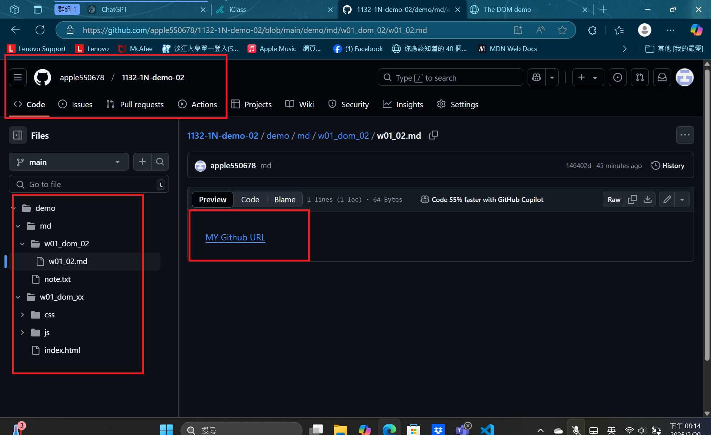
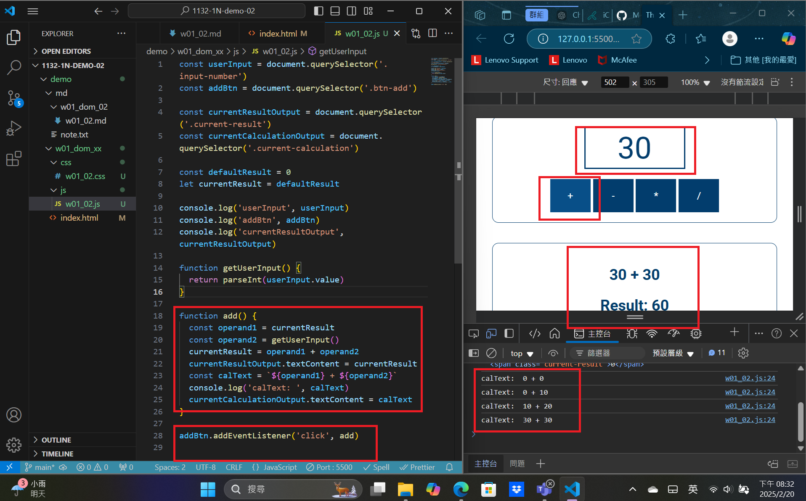
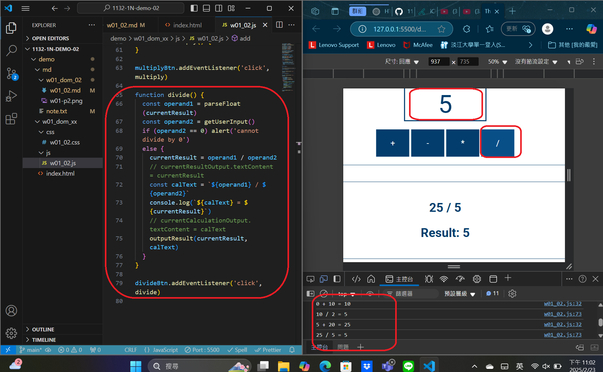
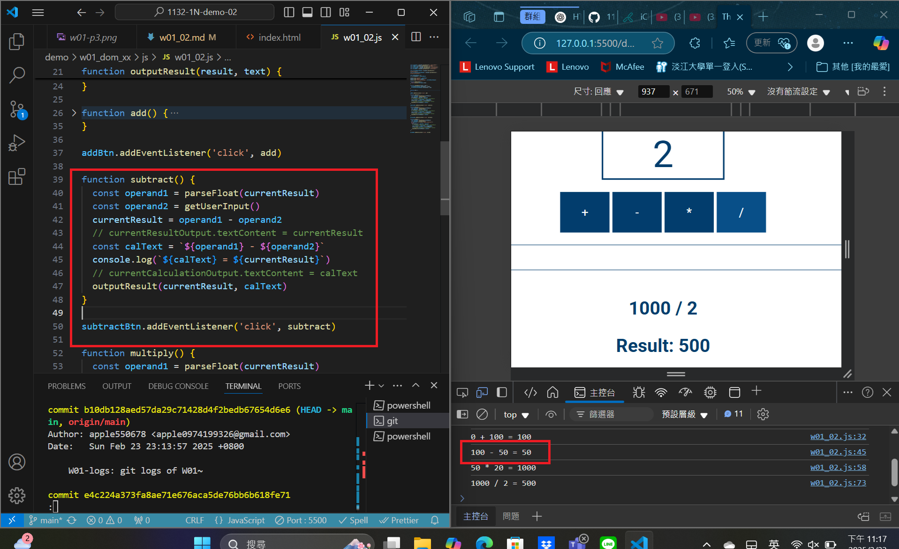
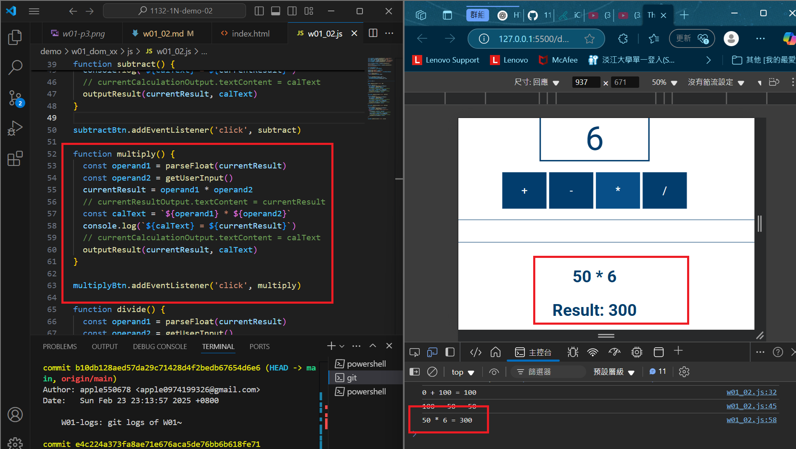

[MY Github URL](https://github.com/apple550678/1132-1N-demo-02)

### W01-logs: git logs of W01



```

```

Video: W01-P2: implement add button



```

```

Video: W01-P3: implement divide button



```

```

### W01-P4: implement subtract button



```

```

### W01-P5: implement multiply button



```

```
