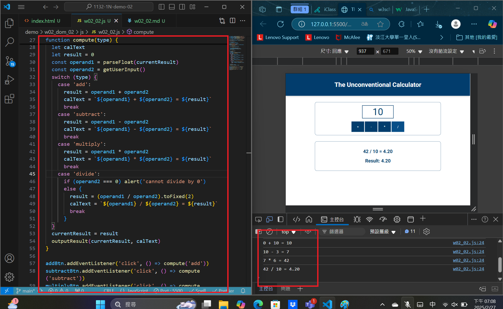
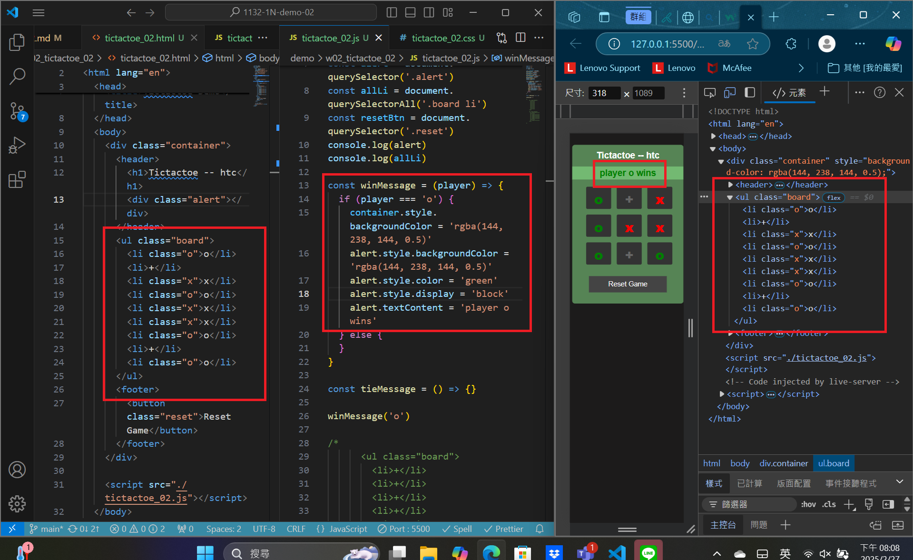
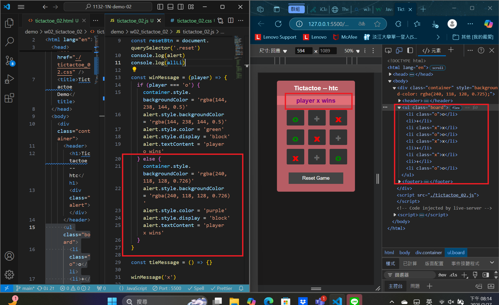
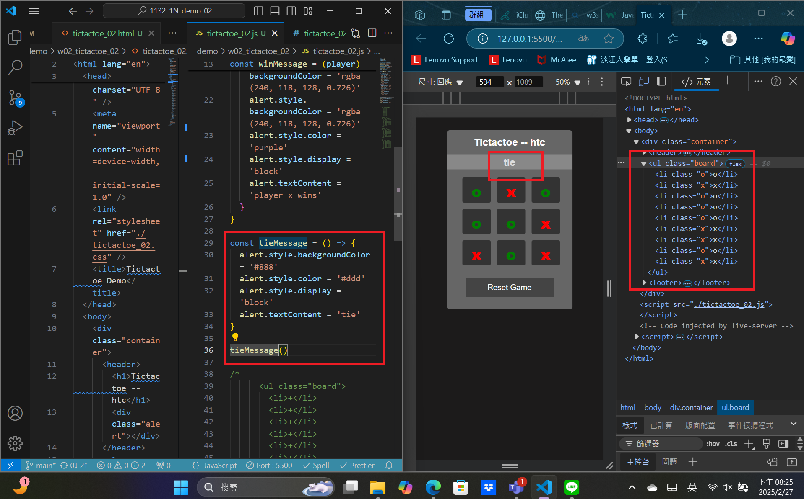

[MY Github URL](https://github.com/apple550678/1132-1N-demo-02)

### W02-P1: refine the code in week 1 using ony one compute function



```
Author: apple550678 <apple0974199326@gmail.com>
Date:   Thu Feb 27 19:13:30 2025 +0800
W02-P1: refine the code in week 1 using ony one compute function
```

### Video: W02-P2: show winning message and tie message

### ==>play o wins



### ==>play x wins



### ==>tie



```

```

### Video: W02-P3: implement divide button


```

```

### W02-P4: implement subtract button


```

```

### W02-P5: implement multiply button


```

```
