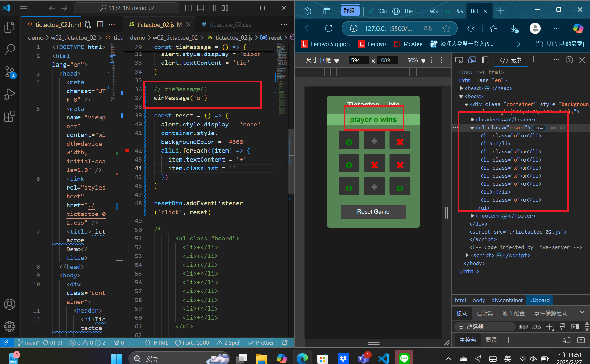
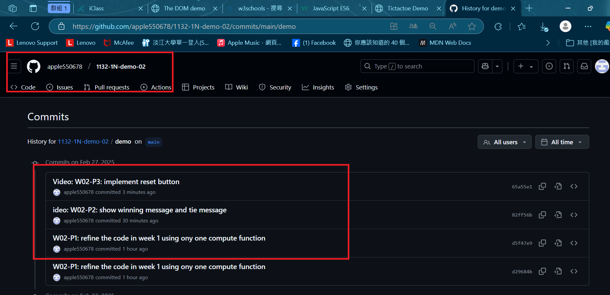

[MY Github URL](https://github.com/apple550678/1132-1N-demo-02)

### W02-P1: refine the code in week 1 using ony one compute function


```
d5f47e9 apple550678     Thu Feb 27 19:13:30 2025 +0800  W02-P1: refine the code in week 1 using ony one compute function
```

### Video: W02-P2: show winning message and tie message

### ==>play o wins


### ==>play x wins


### ==>tie


```
82ff56b apple550678     Thu Feb 27 20:29:39 2025 +0800  ideo: W02-P2: show winning message and tie message
```

### Video: W02-P3: implement reset button

### ==> initially player o win



### ==> after reset button is pressed


```
65a55e1 apple550678     Thu Feb 27 20:56:20 2025 +0800  Video: W02-P3: implement reset button
```

### W02-logs: git logs of W02


