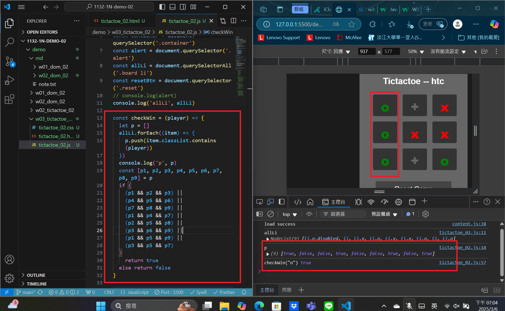
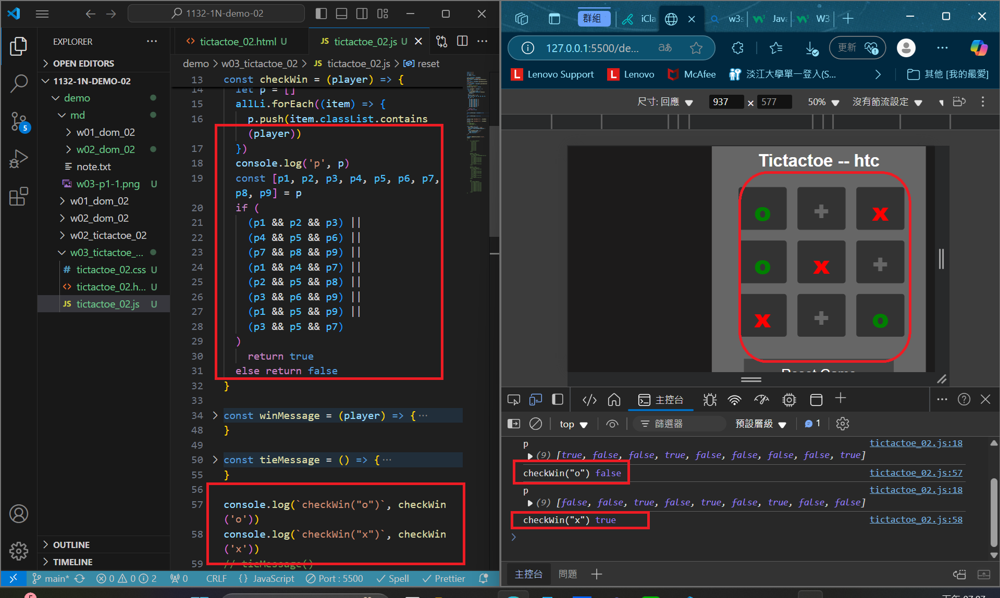
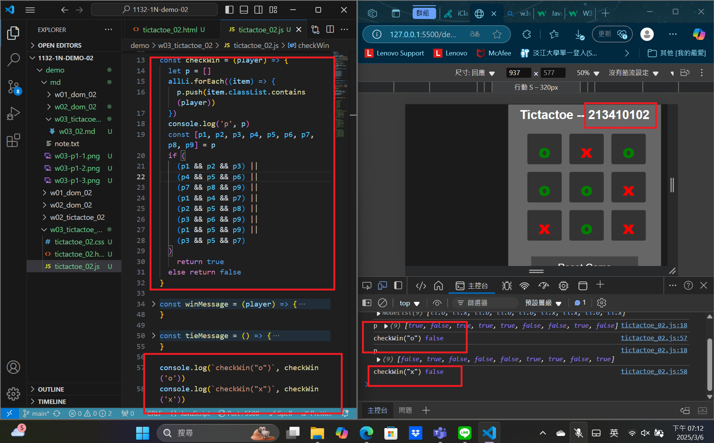
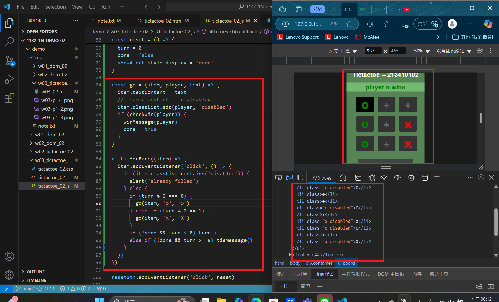
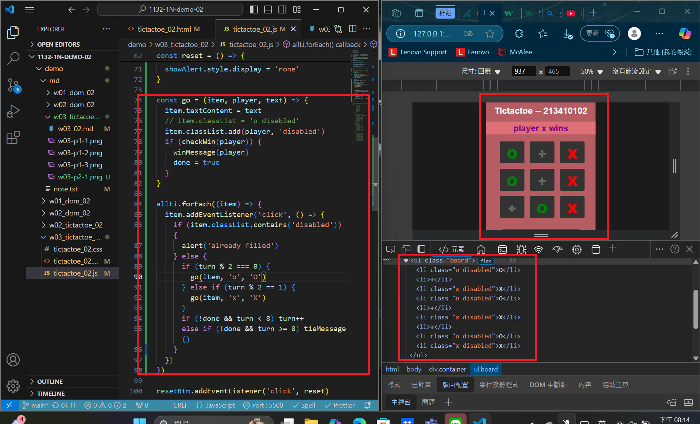
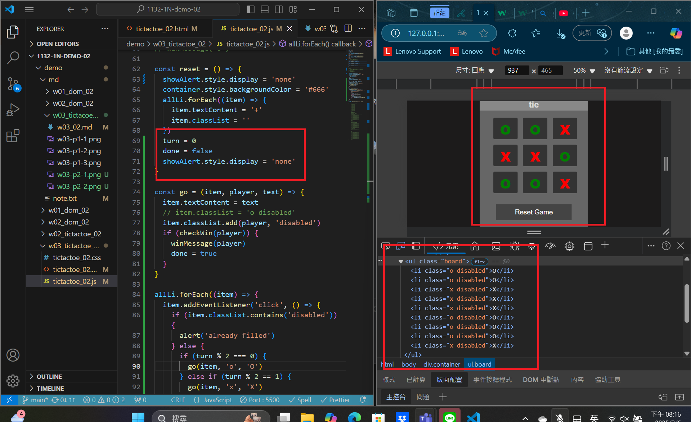
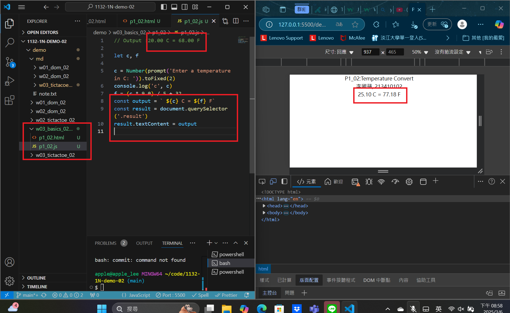

[MY Github URL](https://github.com/apple550678/1132-1N-demo-02)

### Video: W03-P1: Implement checkWin(player) using three different cases

#### => player o wins



#### => player x wins



#### => no player wins



```
0a5bae1 apple550678     Thu Mar 6 19:15:06 2025 +0800   Video: W03-P1: Implement checkWin(player) using three different cases
```

### Video: W03-P2: play TicTacToe successfully

#### => player o wins



#### => player x wins



#### => tie



```
55965a2 apple550678     Thu Mar 6 20:18:05 2025 +0800   Video: W03-P2: play TicTacToe successfully
```

### Video: W03-P3: Temperature Convert from C to F



```

```
