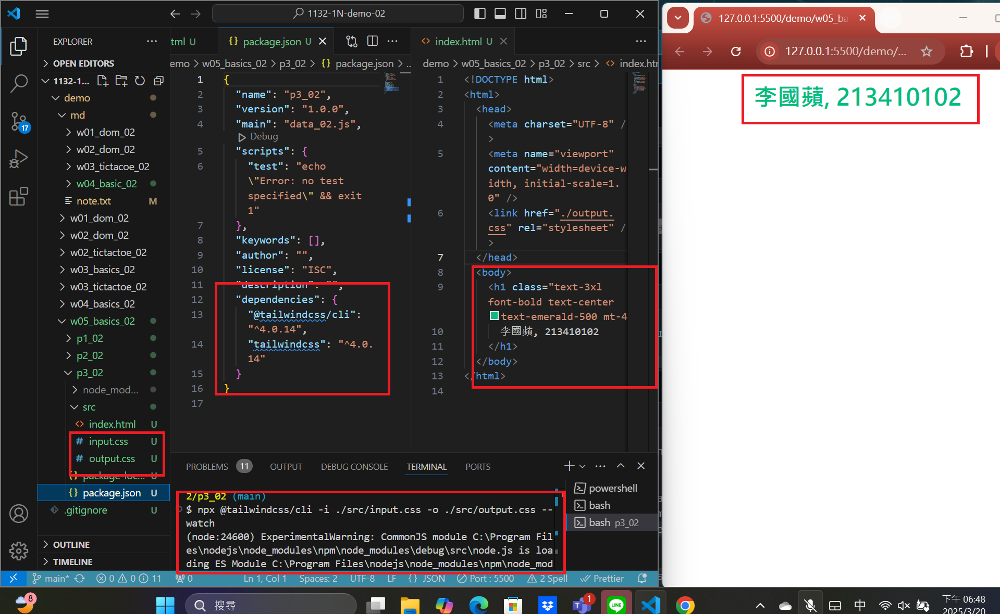
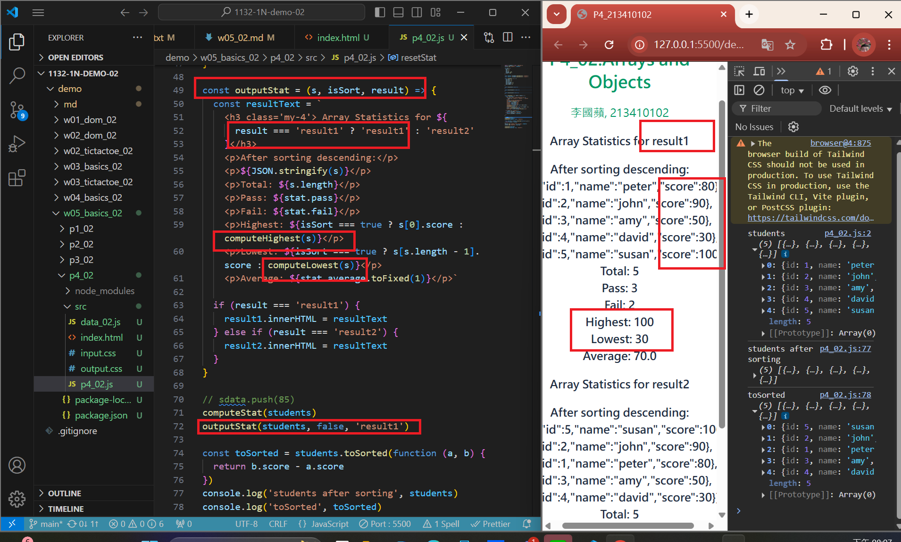
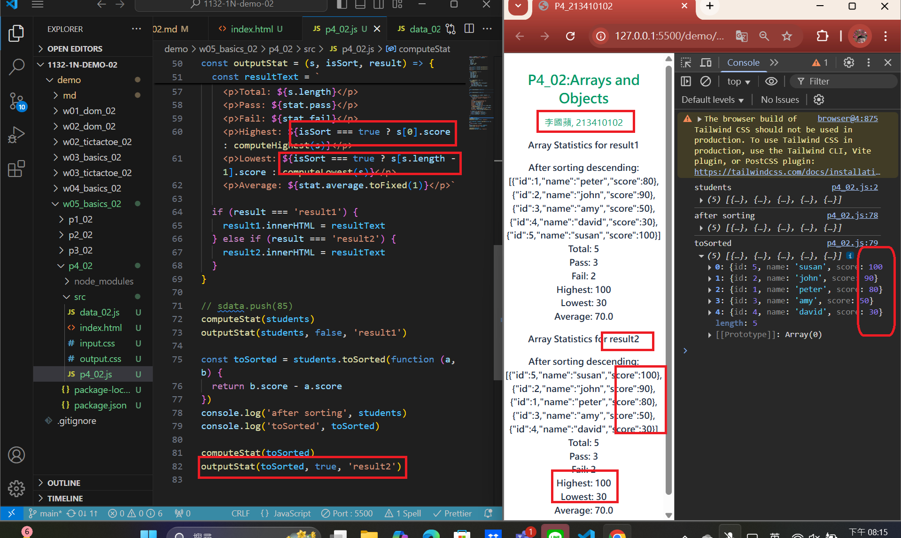
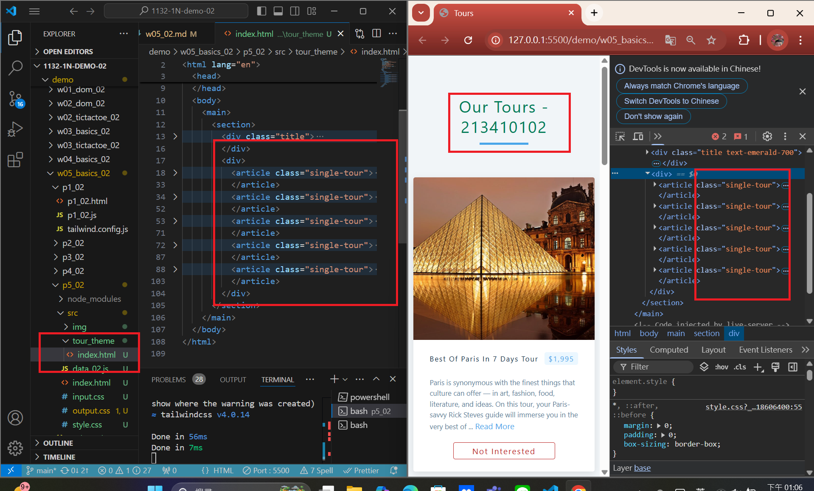
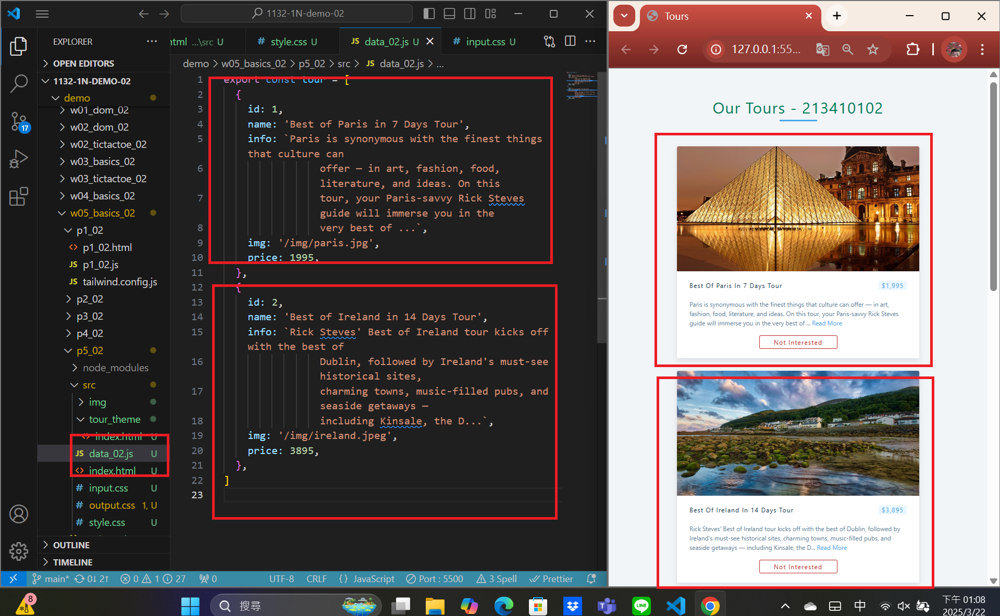

[MY Github URL](https://github.com/apple550678/1132-1N-demo-02)

### Video: W05-P1: Use Tailwindcss CLI to show tailwind css without internet access



```
1666e3d apple550678     Thu Mar 20 18:53:09 2025 +0800  Video: W05-P1: Use Tailwindcss CLI to show tailwind css without internet access
```

### Video: W05-P2: use students object array to show statistics

#### => no sorting, show in result1 section



#### => after sorting, show in result2 section



```
998a5fc apple550678     Thu Mar 20 20:18:08 2025 +0800  Video: W05-P2: use students object array to show statistics
```

### Video: W05-P3: show 5 tours in p5_xx.html using tour theme
 
#### => display 5 tours in tour theme, make tailwind css work as well
 

 
#### => use array tours_xx to store all data of 5 tours
 

 
```

```