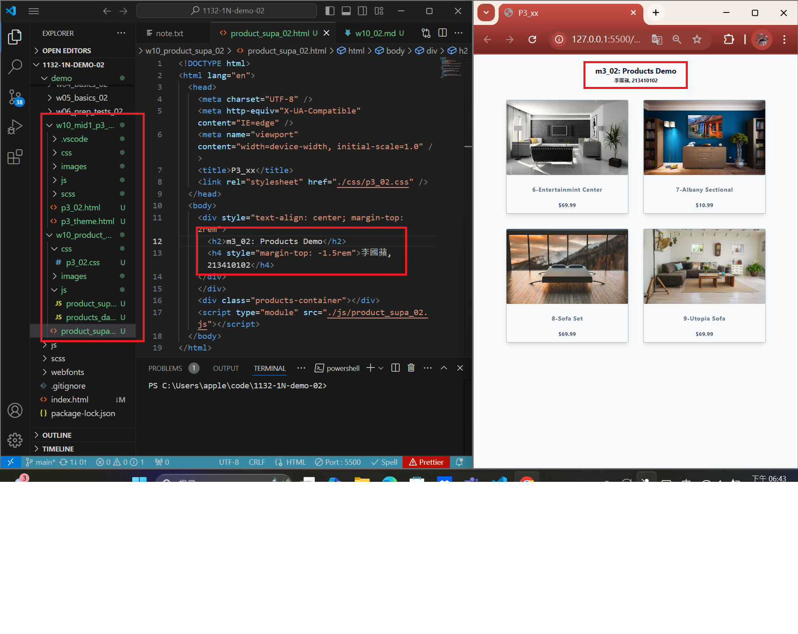
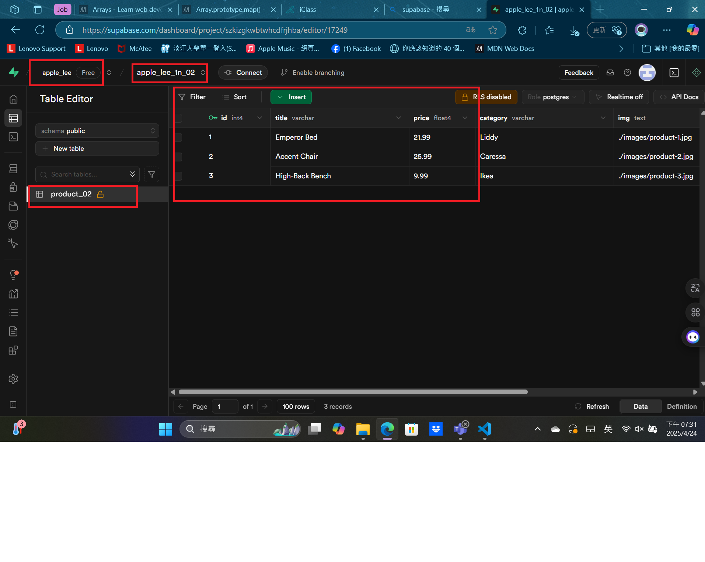
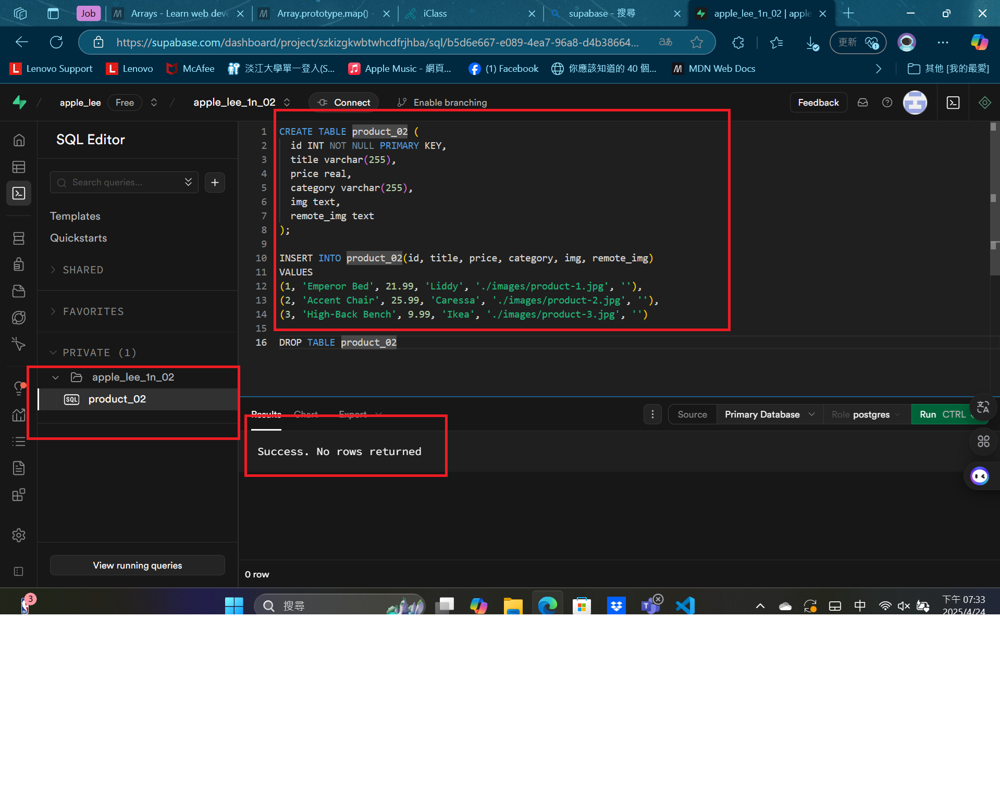
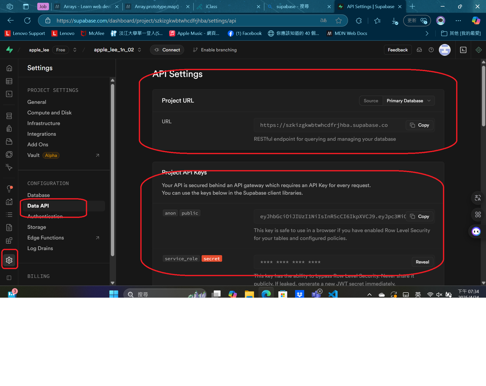

git config --global user.email "apple0974199326@gmail.com"
git config --global user.name "apple550678"

### Video: W10-P1: Copy mid1 m3_xx answer and rearrange it for W10 demo



```
1a8f36d apple550678     Thu Apr 24 18:46:18 2025 +0800  Video: W10-P1: Copy mid1 m3_xx answer and rearrange it for W10 demo
```

### Video: W10-P2: Setup Supabase with project yourcode_1n_xx

#### => show product_xx table with 3 data



#### => show SQL to create product_xx table and insert three data



#### => show Project URL and ANON KEY for this project



```
8aa10e6 apple550678     Thu Apr 24 19:36:32 2025 +0800  Video: W10-P2: Setup Supabase with project yourcode_1n_xx
```
