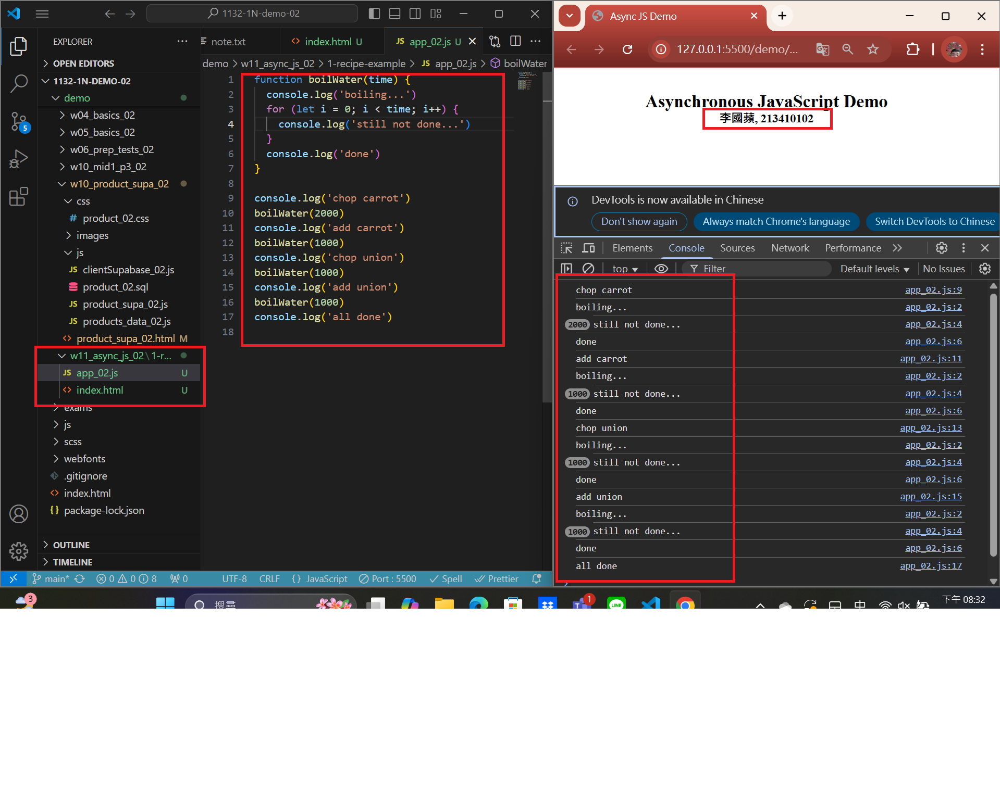
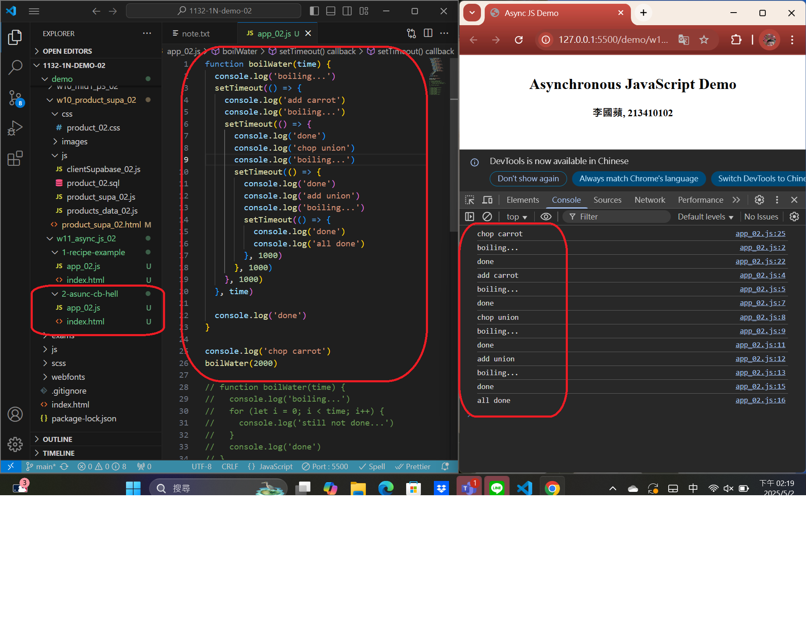
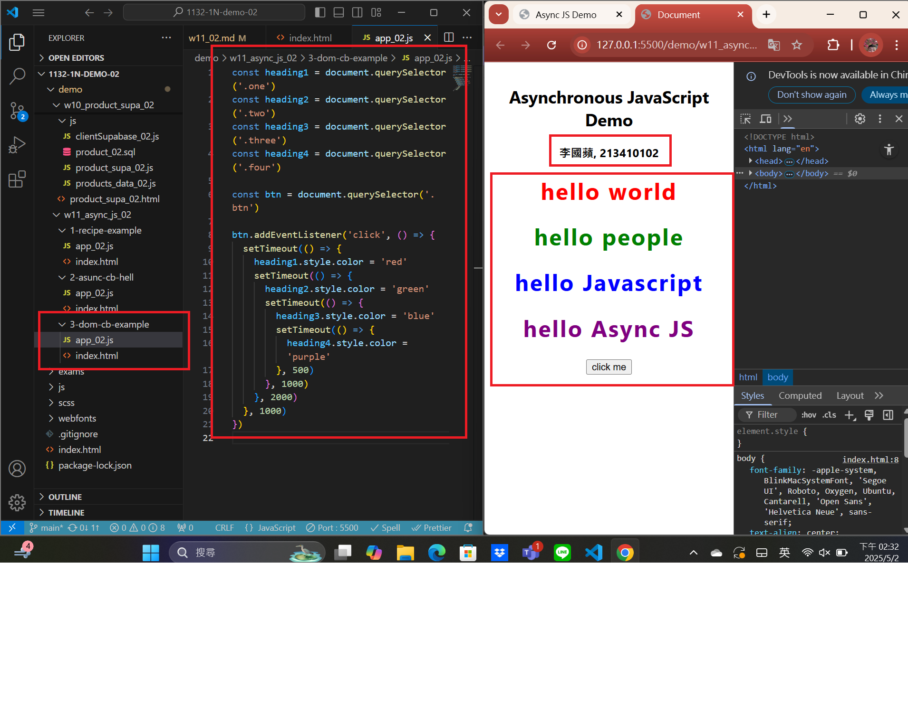
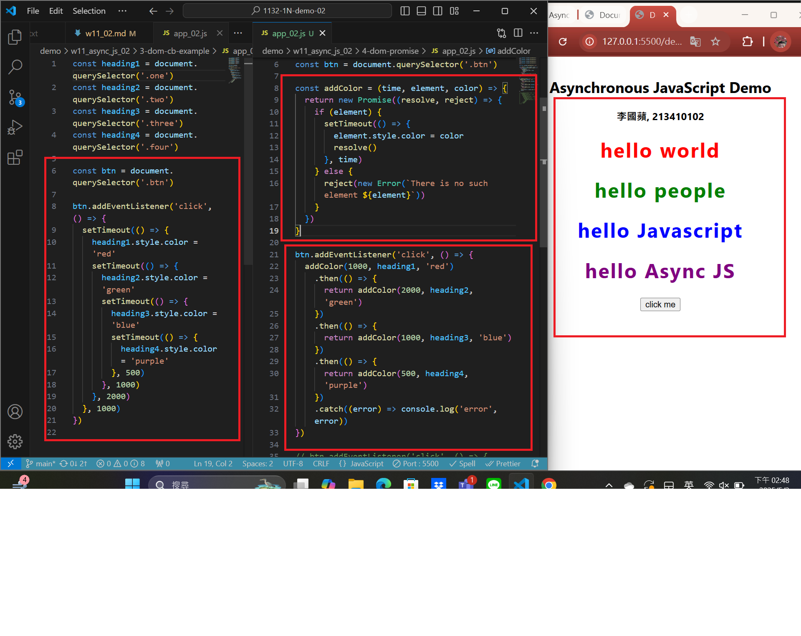
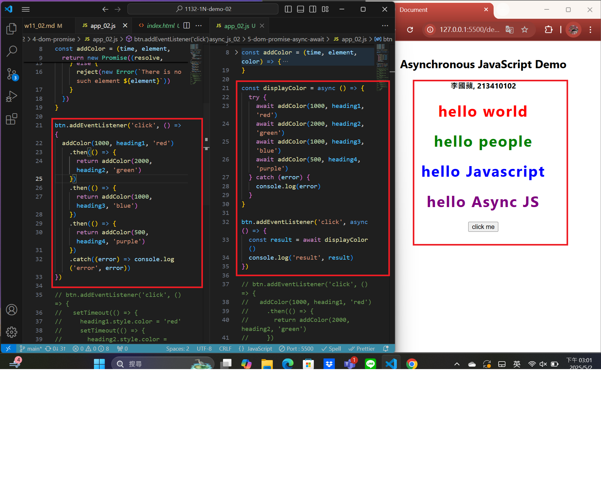

git config --global user.email "apple0974199326@gmail.com"
git config --global user.name "apple550678"

###　 Video: W11-P1: Synchronous vs. Asynchronous

#### => Synchronous demo



#### => Asynchronous demo



```
2108fd4 apple550678     Fri May 2 14:31:09 2025 +0800   Video: W11-P1: Synchronous vs. Asynchronous
```

###　 Video: W11-P2: Asynchronous DOM demo



```
2108fd4 apple550678     Fri May 2 14:31:09 2025 +0800   Video: W11-P1: Synchronous vs. Asynchronous
```

###　 Video: W11-P3: Use Promise to do W11-P2



```
2108fd4 apple550678     Fri May 2 14:31:09 2025 +0800   Video: W11-P1: Synchronous vs. Asynchronous
```

### Video: W11-P4: Use Async Await to do W11-P3



```

```
