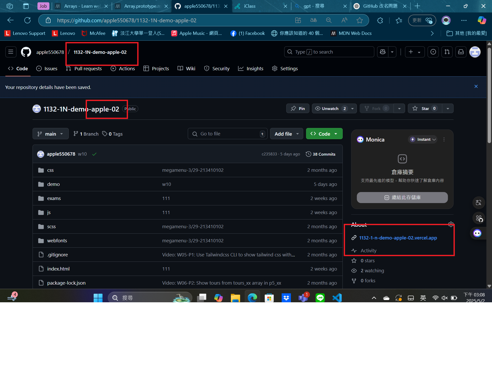
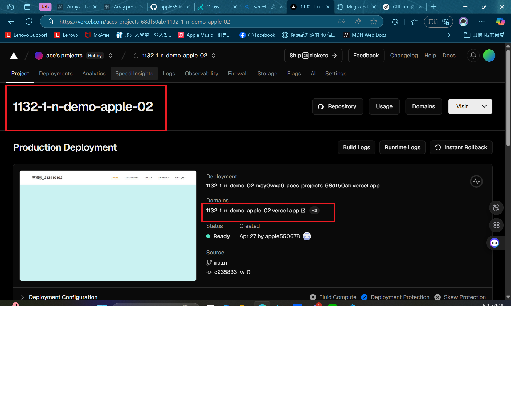

[MY Github URL](https://github.com/apple550678/1132-1N-demo-02)

[Vercel URL](https://1132-1-n-demo-apple-02.vercel.app)

###　 Video: W11-P1: Synchronous vs. Asynchronous

#### => Synchronous demo


#### => Asynchronous demo


```
2108fd4 apple550678     Fri May 2 14:31:09 2025 +0800   Video: W11-P1: Synchronous vs. Asynchronous
```

###　 Video: W11-P2: Asynchronous DOM demo


```
2108fd4 apple550678     Fri May 2 14:31:09 2025 +0800   Video: W11-P1: Synchronous vs. Asynchronous
```

###　 Video: W11-P3: Use Promise to do W11-P2


```
2108fd4 apple550678     Fri May 2 14:31:09 2025 +0800   Video: W11-P1: Synchronous vs. Asynchronous
```

### Video: W11-P4: Use Async Await to do W11-P3


```
2108fd4 apple550678     Fri May 2 14:31:09 2025 +0800   Video: W11-P1: Synchronous vs. Asynchronous
```

###　 Video: W11-P5: Change Github repo name, and Vercel URL

#### => Github



#### => Vercel



```
2108fd4 apple550678     Fri May 2 14:31:09 2025 +0800   Video: W11-P1: Synchronous vs. Asynchronous
```
