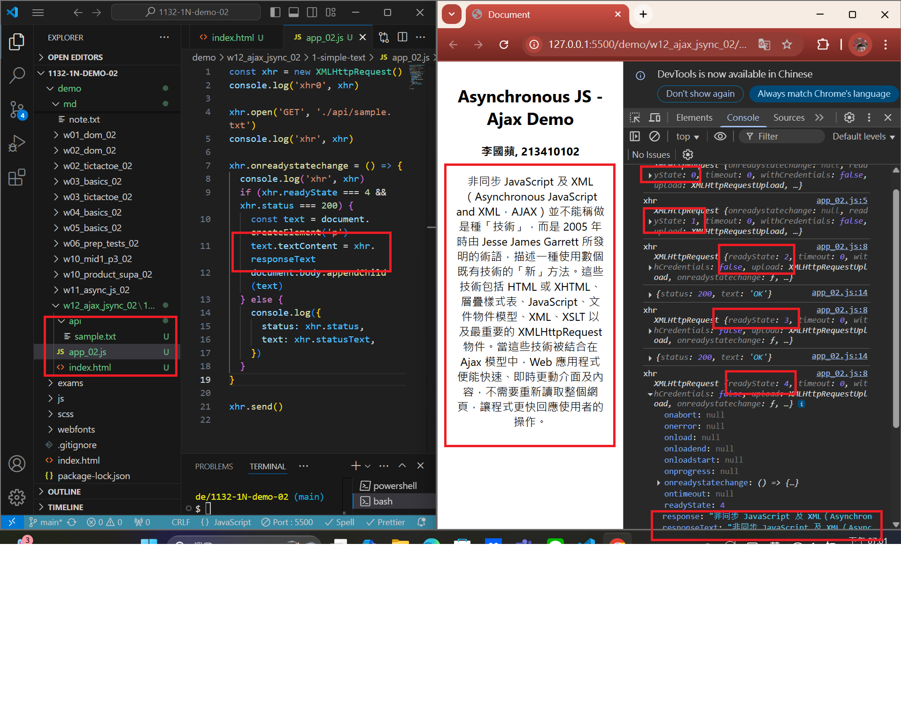
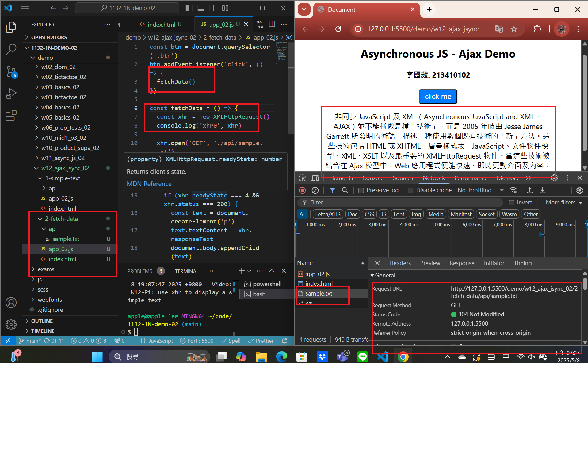
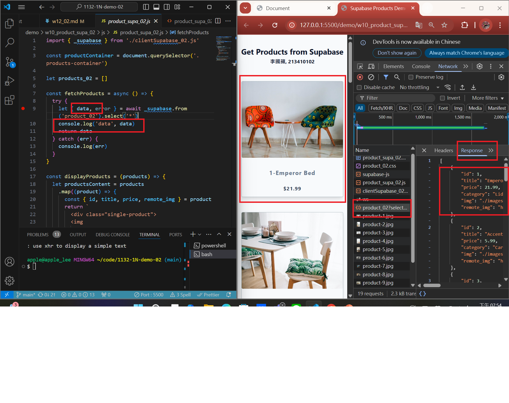
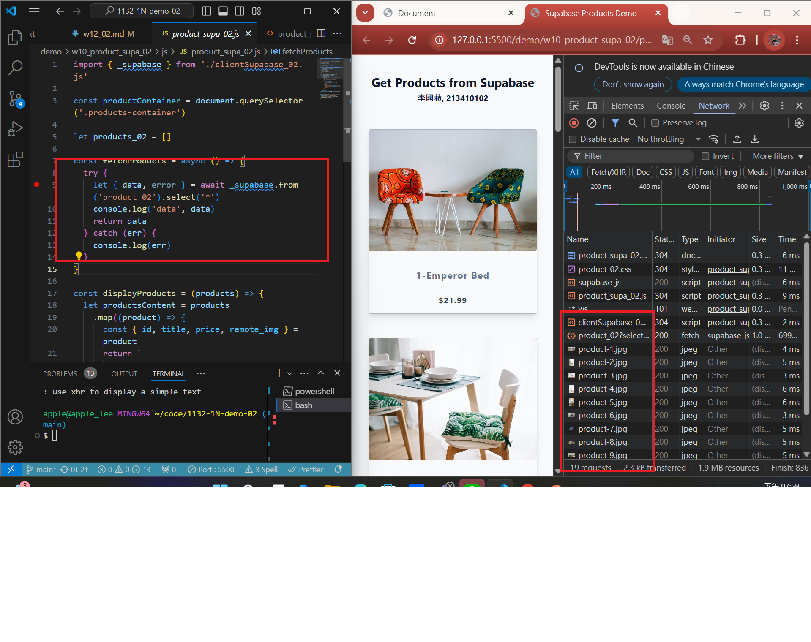
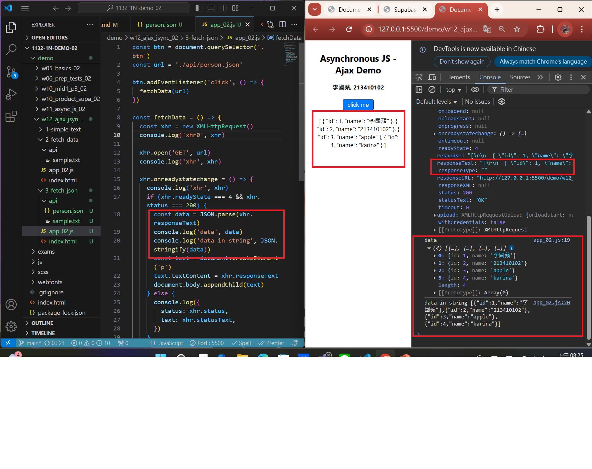
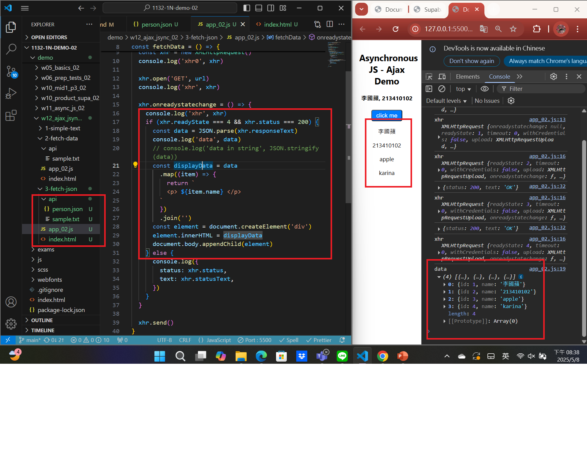
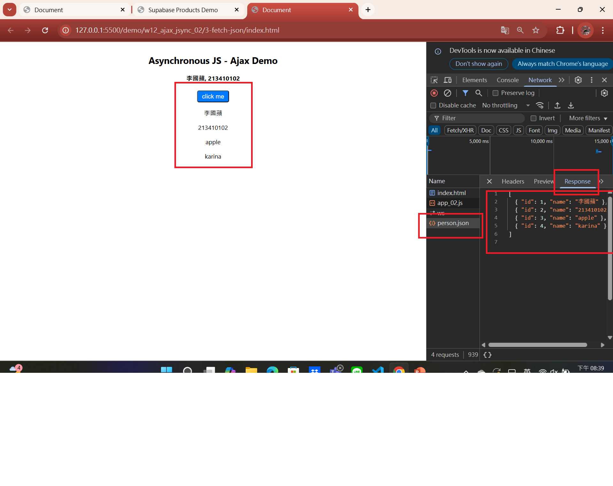

[MY Github URL](https://github.com/apple550678/1132-1N-demo-02)

[Vercel URL](https://1132-1-n-demo-apple-02.vercel.app)

### Video: W12-P1: use xhr to display a simple text



```
ca55498 apple550678     Thu May 8 19:07:47 2025 +0800   Video: W12-P1: use xhr to display a simple text
```

###　 Video: W12-P2: click a button to fetch data



```
ffac14f apple550678     Thu May 8 19:31:07 2025 +0800   Video: W12-P2: click a button to fetch data
```

### Video: W12-P3: Run w10_product_supa_xx, see how it works

#### => \_supabase.from('product_xx').select('\*');


#### => check response



#### => check how many http requests being done in fetchProducts



```
caa1e3c apple550678     Thu May 8 20:46:37 2025 +0800   Video: W12-P3: Run w10_product_supa_xx, see how it works
```

### Video: W12-P4: Fetch person.json string and display name in the browser

#### => use JSON.parse() to convert responseText to JSON array



#### => extract name from data and show it in the browser



#### => check the Network, http response



```
beb9422 apple550678     Thu May 8 20:43:40 2025 +0800   ideo: W12-P4: Fetch person.json string and display name in the browser
```
