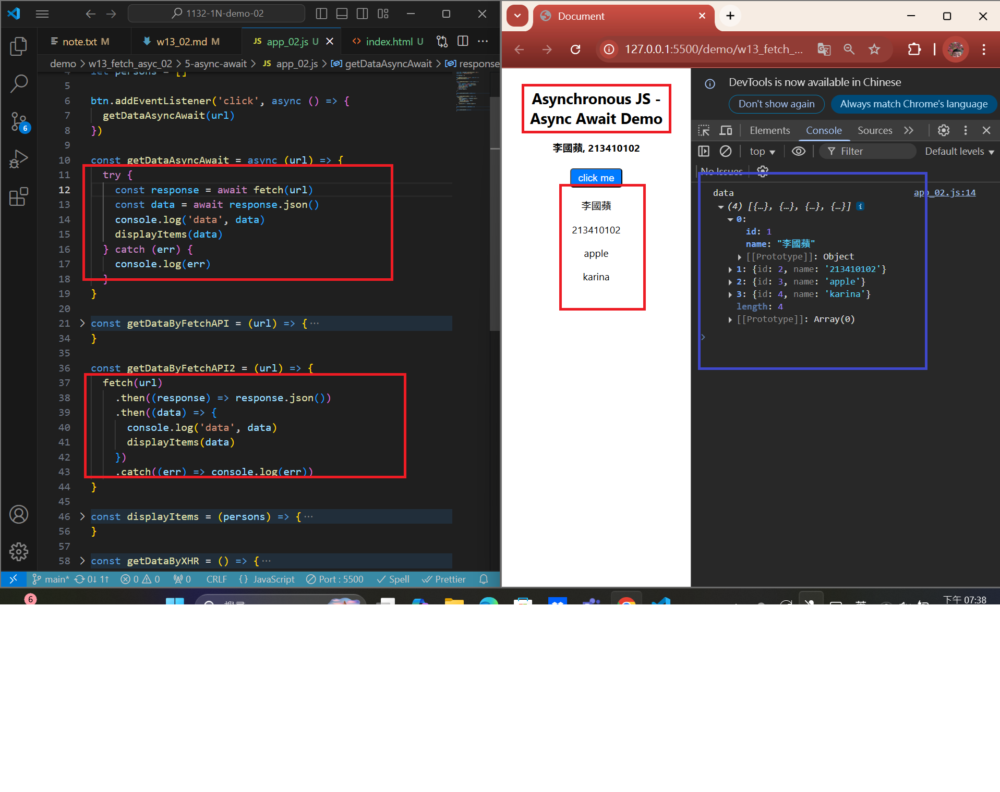
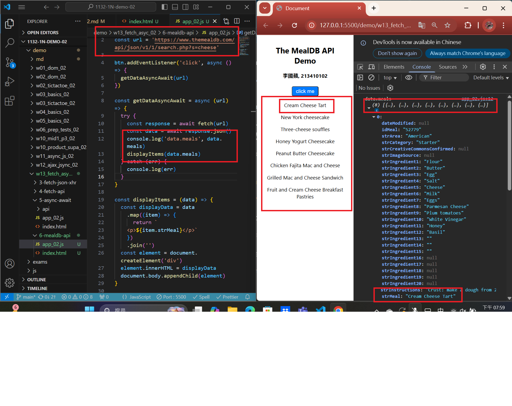
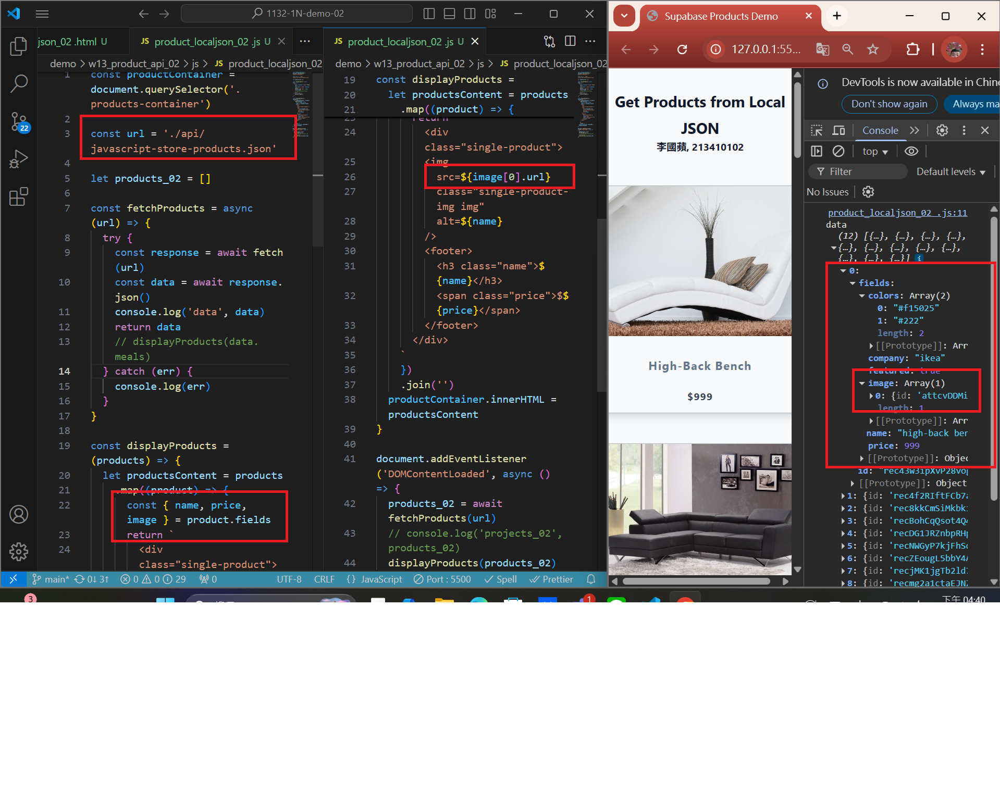
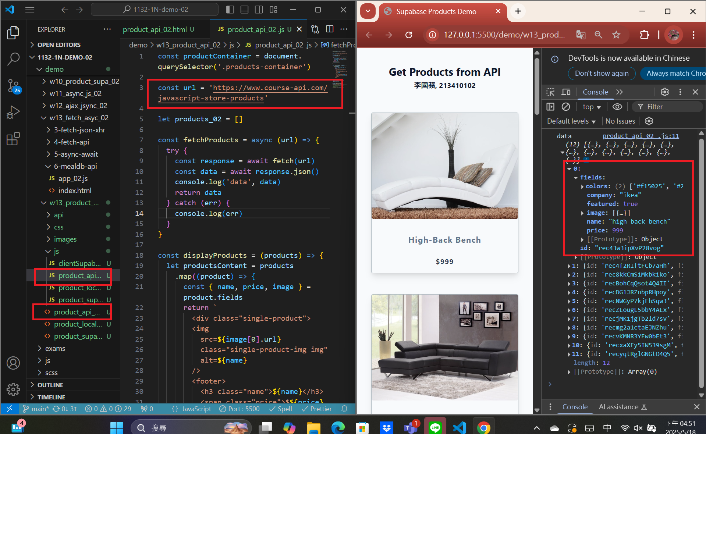

[MY Github URL](https://github.com/apple550678/1132-1N-demo-02)

[Vercel URL](https://1132-1-n-demo-apple-02.vercel.app)

### Video: W13-P1: Use fetch API to replace xhr approach


```
f224305 apple550678     Thu May 15 19:24:04 2025 +0800  Video: W13-P1: Use fetch API to replace xhr approach
```

### Video: W13-P2: Use Async Await to replace fetch API approach



```
6720ecb apple550678     Thu May 15 19:44:52 2025 +0800  Video: W13-P2: Use Async Await to replace fetch API approach
```

### Video: W13-P3: Get meals about cheese from TheMealDB



```
5c0f159 apple550678     Thu May 15 20:12:53 2025 +0800  git log --pretty=format:%h%x09%an%x09%ad%x09%s --after=2025-5-14
```

###　 Video: W13-P4: Get Products from local json and from API

#### => Get products from local json



#### => Get products from API



```

```
