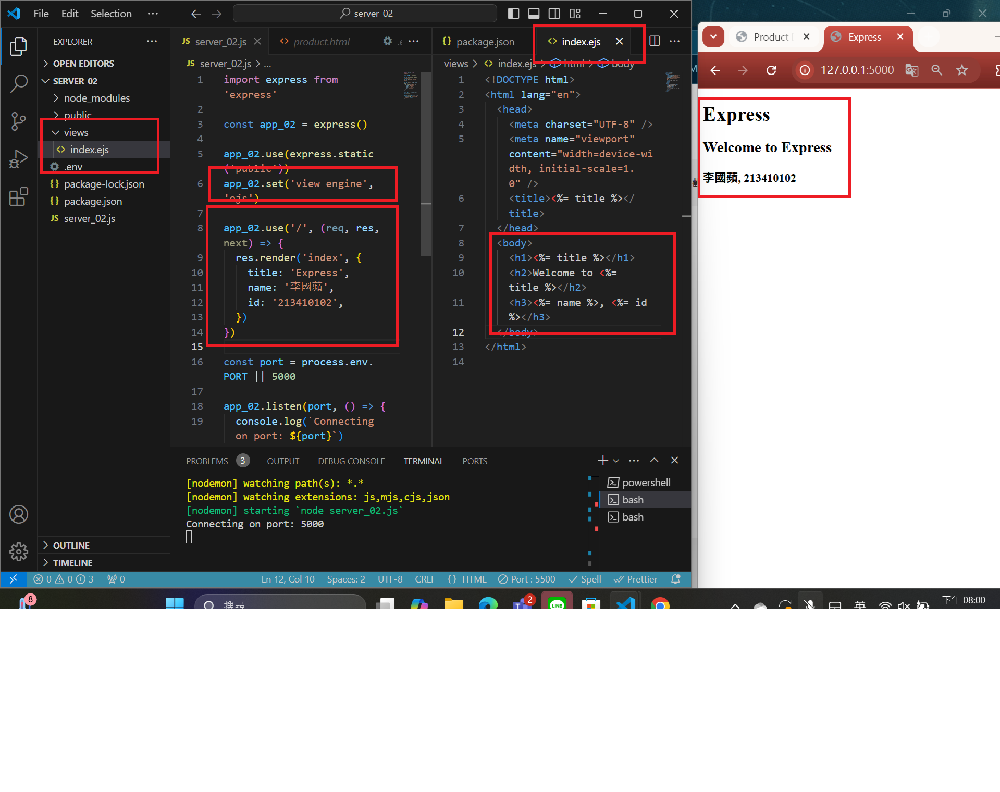
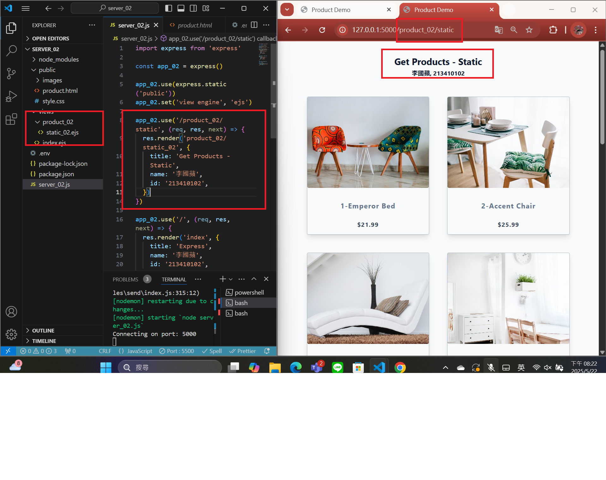
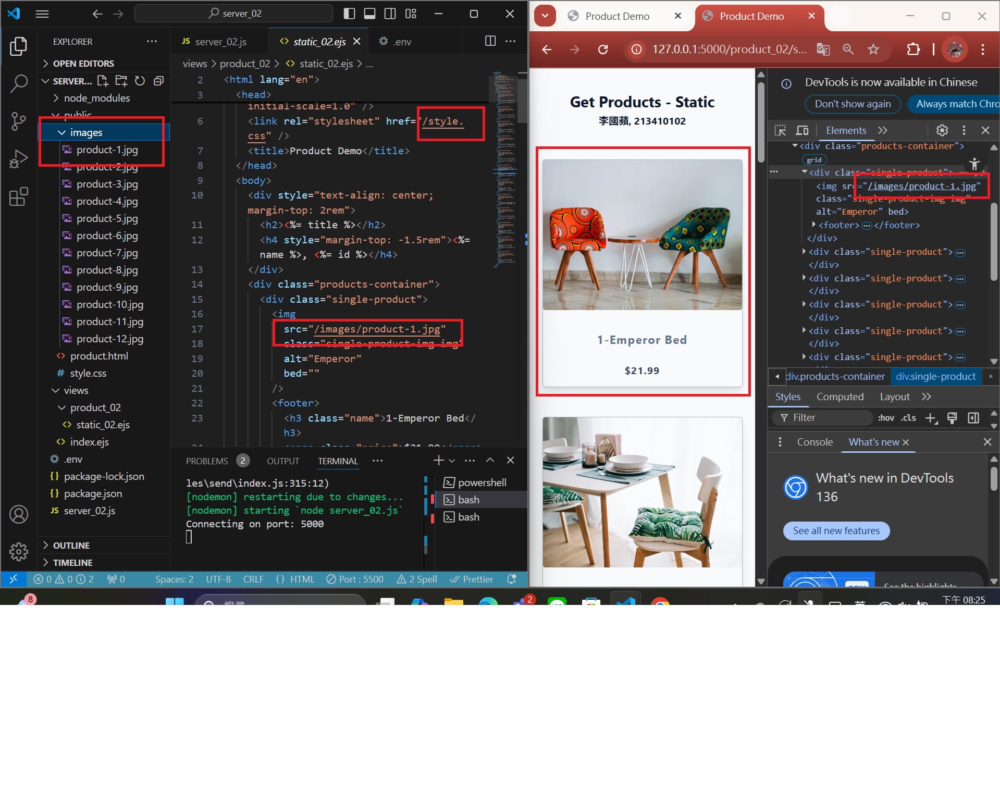
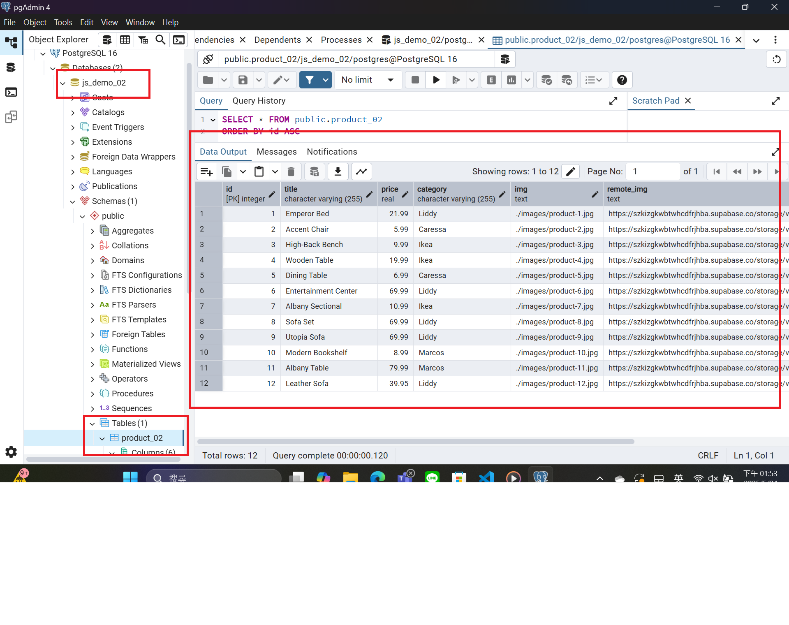
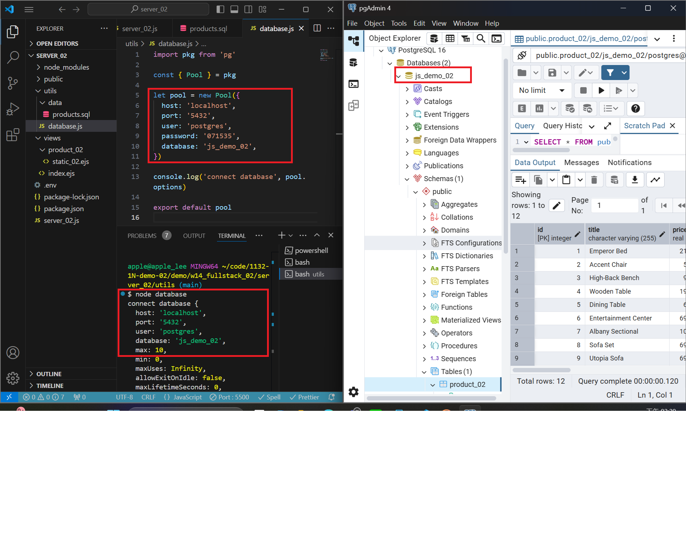
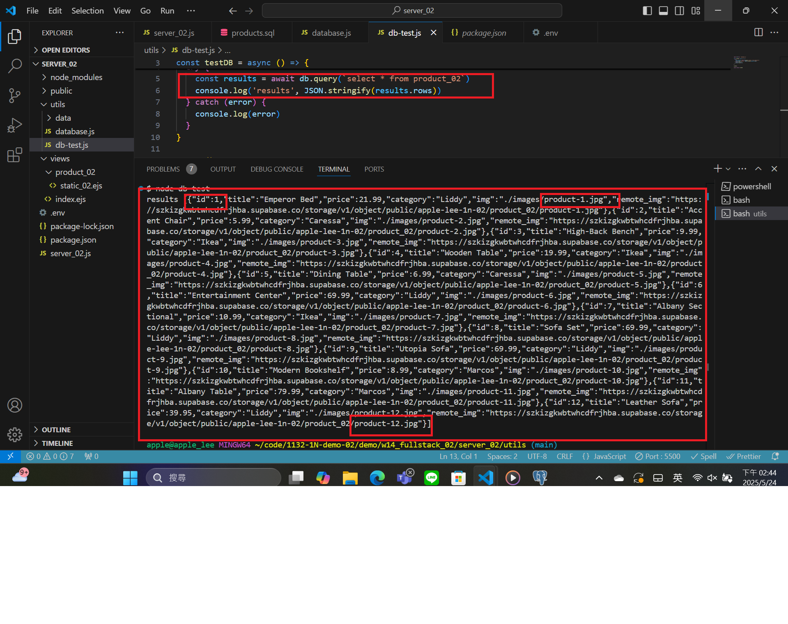
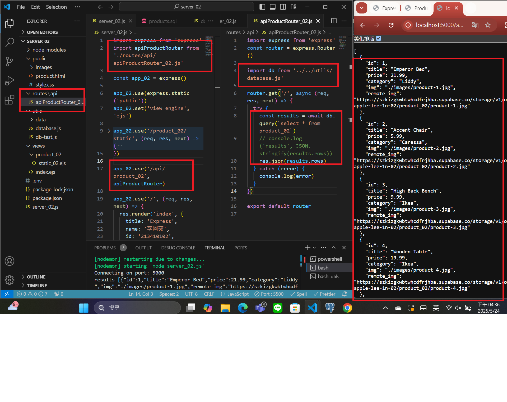

[MY Github URL](https://github.com/apple550678/1132-1N-demo-02)

[Vercel URL](https://1132-1-n-demo-apple-02.vercel.app)

### Video: W14-P1: show first welcome page



```
b13ba7b apple550678     Thu May 22 20:04:38 2025 +0800  Video: W14-P1: show first welcome page
```

###　 Video: W14-P2: Show static products page

#### => show render page with data passed into ejs page



#### => show how the product-1.jpg can be accessed fro public directory as root directory



```
2af7bf6 apple550678     Thu May 22 20:28:34 2025 +0800  Video: W14-P2: Show static products page
```

### Video: W14-P3: Create database js_demo_xx, table product_xx, and insert 12 data, write test code to get all products

#### => Create database js_demo_xx, table product_xx, and insert 12 data



#### => connect js_demo_xx database



#### => get all product data



```
4904d91 apple550678     Sat May 24 14:48:39 2025 +0800  W14-P3: Create database js_demo_xx, table product_xx, and insert 12 data, write test code to get all products
```

### Video: W14-P4: implement route /api/product_xx to return json data



#### =>


```

```
