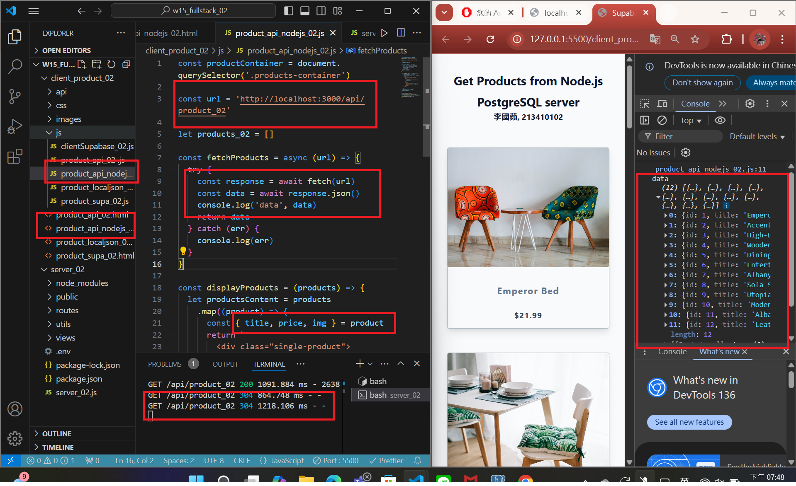
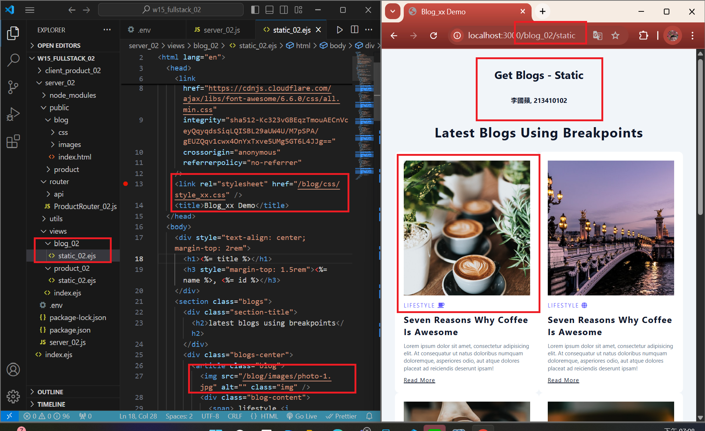

[MY Github URL](https://github.com/apple550678/1132-1N-demo-02)

[Vercel URL](https://1132-1-n-demo-apple-02.vercel.app)

### W15-P1: Set up and test connection to Supabase

#### => add support for .env in package.json


#### => Connection setting to Supabase


#### => For route /api/product_xx, get json from Supabase


```
847fac6 apple550678     Thu May 29 19:16:43 2025 +0800  W15-P1: Set up and test connection to Supabase
```

###　 Video: W15-P2: Get /api/product_xx json and show it in the client side

#### =>



```
6c5fd34 apple550678     Thu May 29 19:52:02 2025 +0800  Video: W15-P2: Get /api/product_xx json and show it in the client side
```

### Video: W15-P3: Show static page of blog theme



```

```
