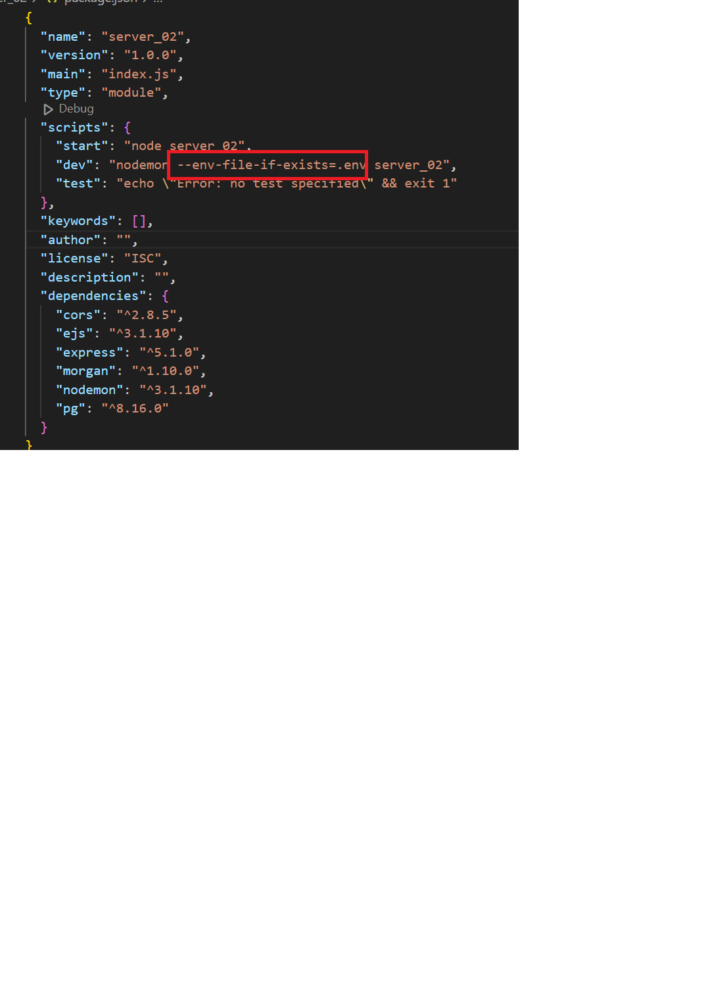
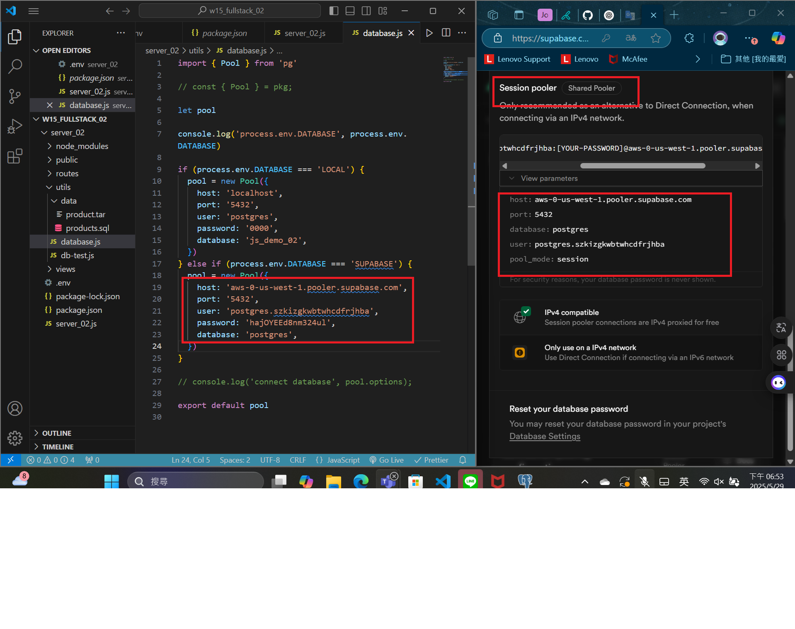
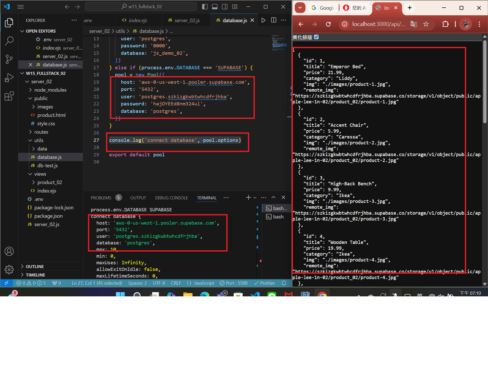

[MY Github URL](https://github.com/apple550678/1132-1N-demo-02)

[Vercel URL](https://1132-1-n-demo-apple-02.vercel.app)

### W15-P1: Set up and test connection to Supabase

#### => add support for .env in package.json



#### => Connection setting to Supabase



#### => For route /api/product_xx, get json from Supabase



```

```
